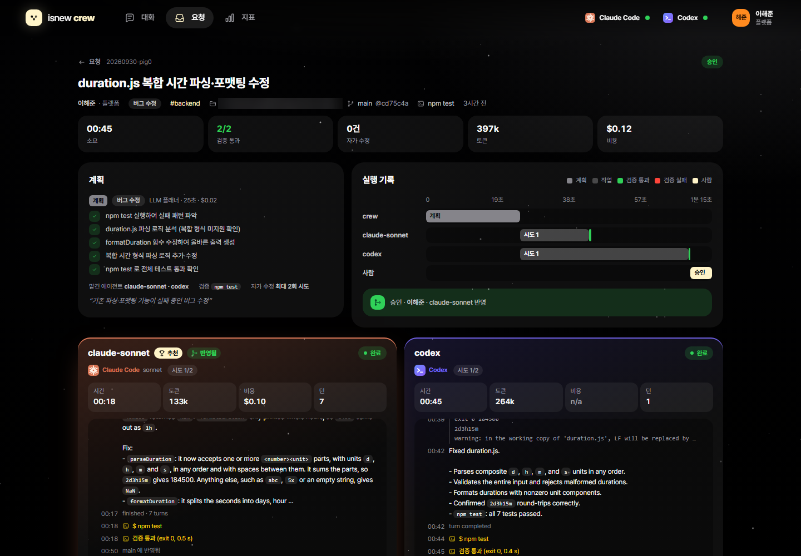
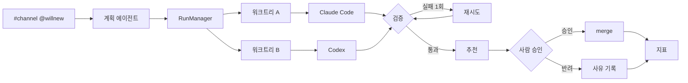

# willnew

팀 AI 에이전트 플랫폼. 채팅에서 `@willnew` 로 요청하면 계획, 병렬 실행, 검증, 자기 수정, 사람 승인, 반영까지 진행.


> 스크린샷과 GIF 는 이름을 바꾸기 전(isnew-crew) 화면이에요. 새 디자인을 코드에 옮긴 뒤 다시 찍어요.

## 흐름

- 요청: 팀 채널에 `@willnew 버그 수정: …`
- 계획: 계획 에이전트(Haiku)가 유형 · 지시문 · 계획 · 검증 명령 결정, 실패 시 키워드 규칙
- 실행: Claude Code · Codex 를 각자 git 워크트리 · 브랜치에서 병렬 실행
- 검증: 워크트리마다 `npm test` 실행, 판정은 테스트가 수행
- 자기 수정: 검증 실패 시 실패 로그를 돌려주고 1회 재시도
- 승인: 통과한 결과 중 가장 빠르고 저렴한 안을 추천, 사람이 승인(`git merge --no-ff`) 또는 반려(사유 기록)
- 지표: 팀 · 템플릿 · 에이전트별 자동 해결률, 승인율, 시간, 비용, 절약 시간(추정), 예산

## 실측

예제 저장소 `examples/duration`, 테스트 7개 전부 실패 상태에서 시작.

| 채널 | 계획 | 실행 | 결과 |
|---|---|---|---|
| `#backend` 버그 수정 | 24.8 s · $0.02 | sonnet 19 s $0.10 · codex 45 s | 둘 다 1차 통과, sonnet 승인 후 병합 |
| `#data` 테스트 작성 | 15.5 s · $0.02 | sonnet 37 s $0.20 | 1차 실패, 자기 수정 후 통과, 승인 |
| `#content-ops` 문서화 | 23.1 s · $0.02 | sonnet 33 s $0.19 | 1차 실패, 자기 수정 후에도 실패, 반려 |

- 요청 3건 · 자동 해결 67 % · 승인율 67 % · 총 $0.55
- 절약 시간은 템플릿별 가정치 × 승인 건, 측정값 아님
- 환경: Windows 11 · Claude Code 2.1 · Codex CLI 0.151 · 2026-09-30

| 대화 | 요청 | 지표 |
|---|---|---|
|  |  |  |

## 실행

```bash
pnpm install && pnpm build
node scripts/demo-repo.mjs ../willnew-demo
node dist/server/cli.js serve --repo ../willnew-demo --check "npm test"
```

- 주소 `http://127.0.0.1:7777`, `#backend` 에서 `@willnew duration 테스트 실패`
- 필요: Node 20+, git, `claude` 또는 `codex` 로그인
- 외부 접속 `--host 0.0.0.0` 은 토큰 필수

## 구조



| 파일 | 역할 |
|---|---|
| `src/server/triage.ts` | 계획 에이전트 |
| `src/server/runs.ts` | 워크트리 · 실행 · 검증 · 재시도 · 승인 |
| `src/server/adapters.ts` | Claude Code · Codex · 오프라인 script 어댑터 |
| `src/server/chat.ts` | 채팅 창구 |
| `src/server/metrics.ts` | 팀 · 템플릿 · 에이전트 지표 |
| `src/server/templates.ts` | 업무 템플릿 · 팀 · 예산 |
| `web/` | React UI. 색·글자·모서리는 전부 테마 변수로만 쓴다 |
| `web/src/theme/public/` | 공개 기본 테마(중립 색 · 시스템 서체 · Lucide 아이콘) |
| `scripts/shoot.mjs` | 화면 캡처 · GIF 프레임 녹화(원격 디버깅 크롬) |

## 테마

저장소에는 중립 기본 테마만 들어 있어요. 같은 변수 이름으로 `theme.css` 와 `icons.ts` 를 담은 폴더를 만들고 `WILLNEW_THEME_DIR` 로 가리키면 그 테마로 빌드돼요. 스크린샷의 모습은 저장소에 없는 개인 테마예요.

```bash
WILLNEW_THEME_DIR=../my-theme pnpm build
```

## 개발

```bash
pnpm test        # 11개, 오프라인 에이전트로 전 과정 검증
pnpm typecheck
```

## 제한

- Codex 는 Windows 에서 `danger-full-access`, 워크트리로 격리
- Codex 비용 미보고
- 미구현: Slack 연동, 동시 실행 한도, 스레드 재요청, 원격 실행기

코드는 MIT. 이름 · 로고 · 스크린샷 속 개인 테마는 라이선스에 포함되지 않아요([NOTICE](NOTICE)).
