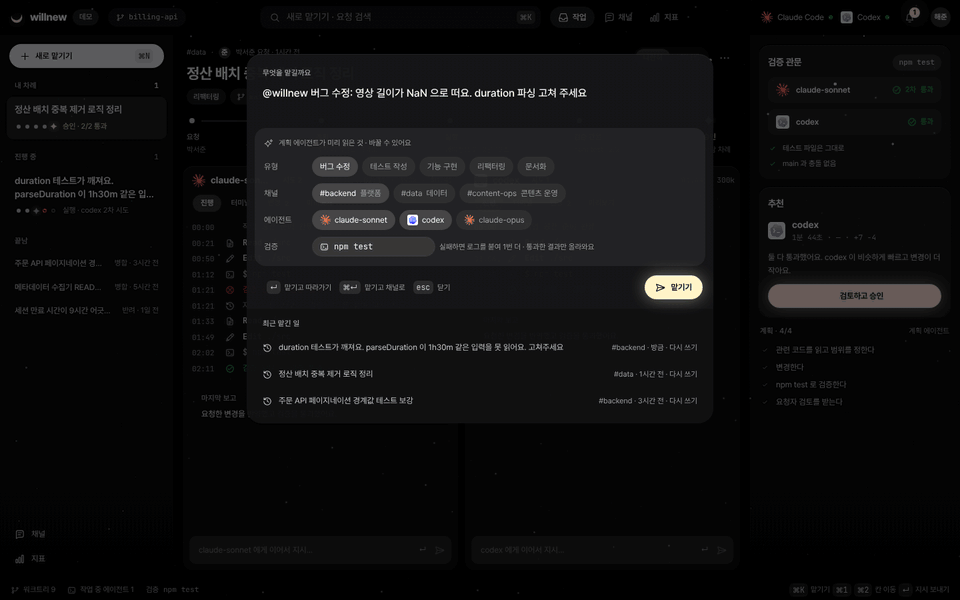
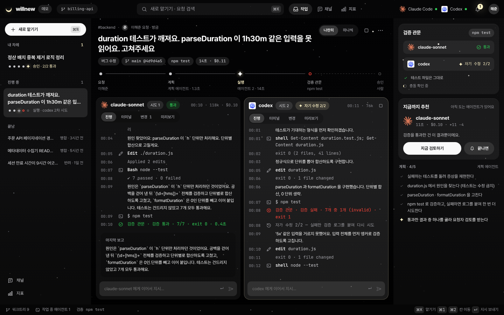
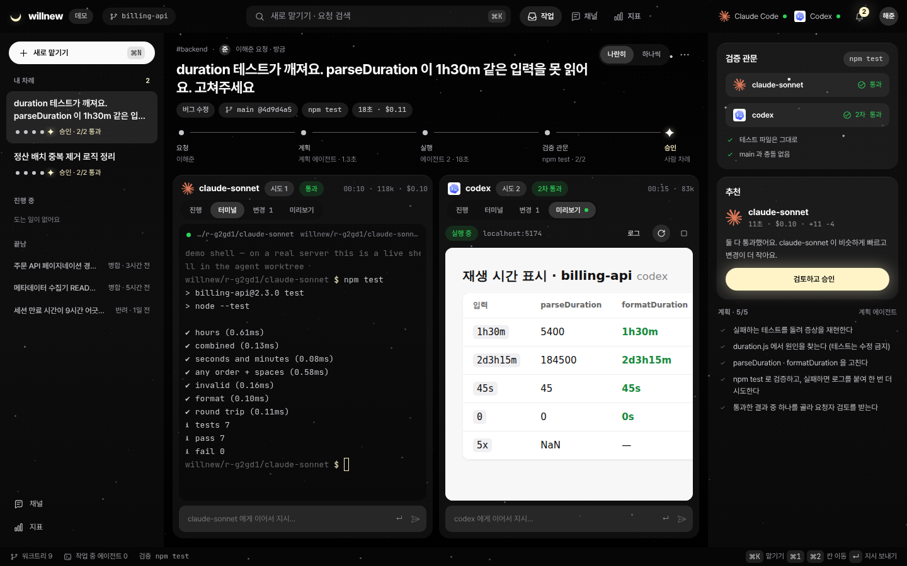
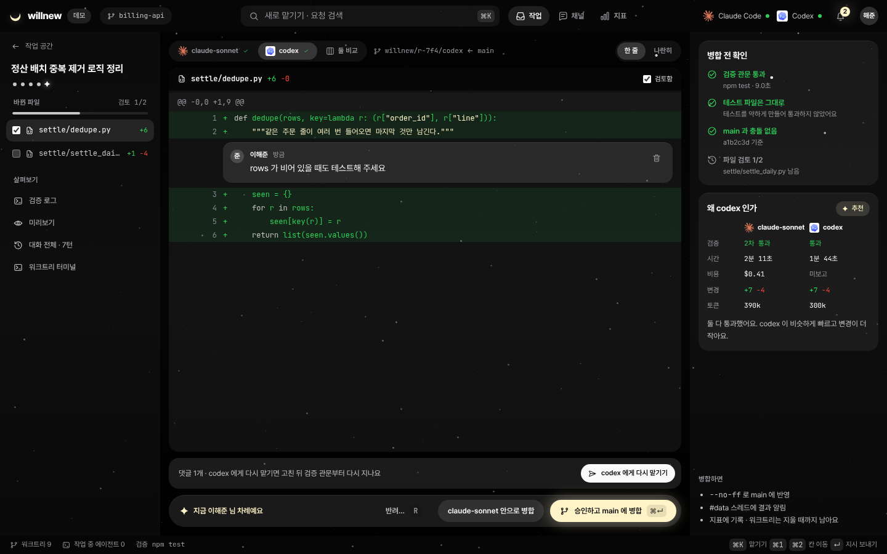
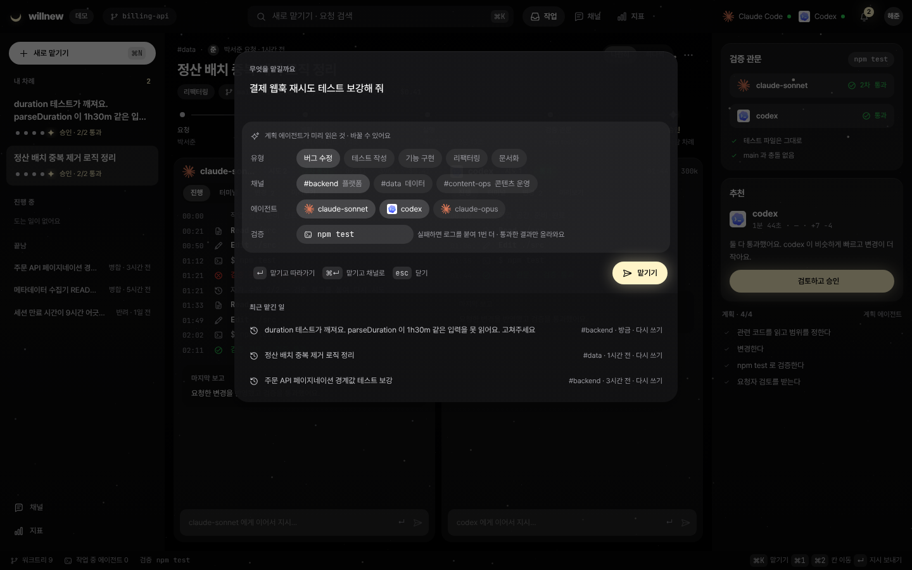
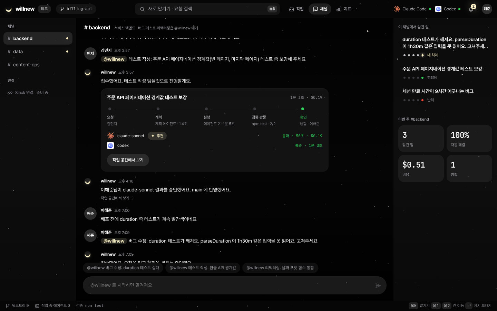
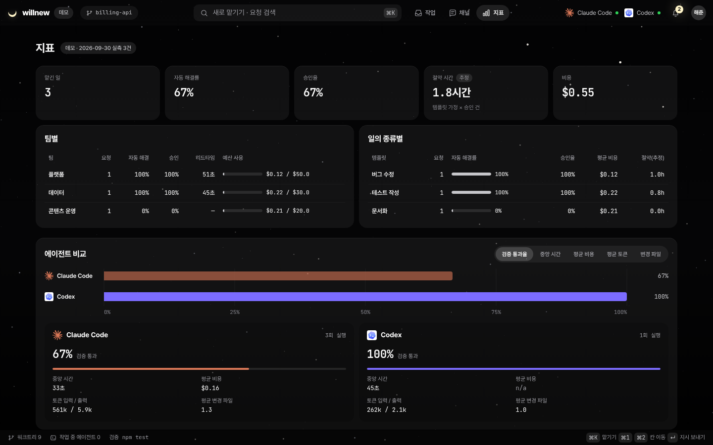
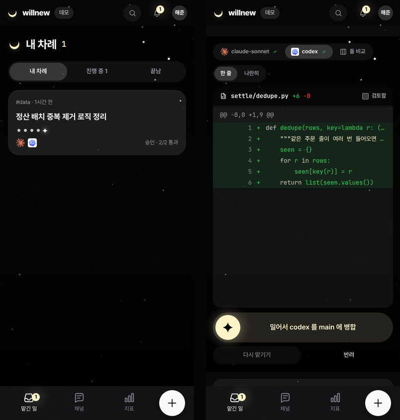
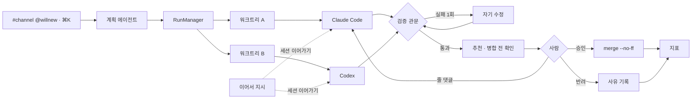

# willnew

팀 AI 에이전트 플랫폼. 채널에서 `@willnew` 로 맡기면 계획 에이전트가 나누고, Claude Code · Codex 가 각자 git 워크트리에서 동시에 일하고, **테스트를 통과한 결과만** 사람에게 올라와 승인으로 병합됩니다.




## 혼자 쓰는 에이전트 도구와 다른 점

에이전트 여러 개를 워크트리에서 돌리고 지켜보는 도구는 이미 있습니다. willnew 는 그 위에 **팀이 맡기고, 검증된 결과만 사람이 받는** 흐름을 얹었습니다.

| | |
|---|---|
| **검증 관문** | 결과마다 검증 명령(`npm test` 등)을 돌려 통과한 것만 승인으로 올립니다. 테스트 파일을 고쳐서 통과한 결과는 따로 표시하고 추천에서 뒤로 뺍니다. 병합 전에 `main` 과 충돌하는지도 미리 봅니다 |
| **겨루고 추천** | 같은 일을 에이전트 여러 개가 동시에 하고, 시간 · 비용 · 변경 크기를 근거로 하나를 추천합니다. 실패하면 실패 로그를 붙여 스스로 한 번 더 고칩니다 |
| **팀 창구와 지표** | 팀 채널에서 `@willnew` 로 맡기고 채널에서 바로 승인 · 반려합니다. 팀 · 템플릿 · 에이전트별 자동 해결률 · 승인율 · 비용 · 예산을 봅니다 |
| **IDE 기본기** | 에이전트 칸마다 실제 터미널 · 변경 · 미리보기, 일하는 중에도 이어서 지시, 줄 댓글을 모아 다시 맡기기, 단축키 |

## 흐름

- **맡기기** — 채널에 `@willnew 버그 수정: …`, 또는 어디서든 `⌘K`. 계획 에이전트(Haiku)가 유형 · 지시문 · 계획 · 검증 명령을 정하고, 안 되면 키워드 규칙
- **실행** — Claude Code · Codex 를 각자 워크트리 · 브랜치에서 병렬로. 칸마다 진행 · 터미널 · 변경 · 미리보기
- **이어서 지시** — 일하는 중에 보내면 지금 턴을 멈추고 같은 세션으로 이어서 반영(Claude `--resume`, Codex `exec resume`). 끝난 뒤에 보내면 다시 열어 고치고 검증 관문을 다시 지납니다
- **검증 관문** — 검증 명령의 종료 코드가 판정. 실패하면 로그를 돌려주고 1회 자기 수정
- **검토 · 승인** — 파일마다 검토함 체크, 줄 댓글 → 에이전트에게 다시 맡기기, 병합 전 확인(검증 · 테스트 파일 · 충돌 · 검토 진행), 승인(`git merge --no-ff`) 또는 사유를 남긴 반려. 휴대폰에서는 밀어서 승인
- **지표** — 팀 · 템플릿 · 에이전트별 자동 해결률, 승인율, 시간, 비용, 절약 시간(가정치), 예산

## 화면

| 작업 공간 — 실행 중, 자기 수정 | 터미널 · 미리보기 |
|---|---|
|  |  |
| **검토 · 승인 — 줄 댓글, 병합 전 확인** | **새로 맡기기 (⌘K)** |
|  |  |
| **팀 채널** | **지표 (실측 3건)** |
|  |  |



스크린샷과 GIF 는 서버 없이 도는 데모 모드(`/?demo`)에 개인 테마를 입혀 찍었습니다. 저장소에는 중립 기본 테마가 들어 있습니다([테마](#테마)).

## 실측

예제 저장소 `examples/duration`, 테스트 7개 전부 실패 상태에서 시작.

| 채널 | 계획 | 실행 | 결과 |
|---|---|---|---|
| `#backend` 버그 수정 | 24.8 s · $0.02 | sonnet 19 s $0.10 · codex 45 s | 둘 다 1차 통과, sonnet 승인 후 병합 |
| `#data` 테스트 작성 | 15.5 s · $0.02 | sonnet 37 s $0.20 | 1차 실패, 자기 수정 후 통과, 승인 |
| `#content-ops` 문서화 | 23.1 s · $0.02 | sonnet 33 s $0.19 | 1차 실패, 자기 수정 후에도 실패, 반려 |

- 요청 3건 · 자동 해결 67 % · 승인율 67 % · 총 $0.55
- 절약 시간은 템플릿별 가정치 × 승인 건, 측정값 아님
- 환경: Windows 11 · Claude Code 2.1 · Codex CLI 0.151 · 2026-09-30

## 실행

```bash
pnpm install && pnpm build
node scripts/demo-repo.mjs ../willnew-demo
node dist/server/cli.js serve --repo ../willnew-demo --check "npm test" --preview "npm run dev -- --port {port}"
```

- 주소 `http://127.0.0.1:7777`. `⌘K` 로 맡기거나 `#backend` 에서 `@willnew duration 테스트 실패`
- `--preview` 는 에이전트 워크트리마다 띄울 개발 서버 명령. `{port}` 와 `PORT` 에 빈 포트가 들어가 서로 겹치지 않습니다
- 서버 없이 화면만 보려면 `/?demo`
- 필요: Node 20+, git, `claude` 또는 `codex` 로그인
- 외부 접속 `--host 0.0.0.0` 은 토큰 필수 (터미널이 열리므로)

## 단축키

| 키 | 동작 |
|---|---|
| `⌘K` · `⌘N` | 새로 맡기기 |
| `⌘1` `⌘2` … | 에이전트 칸으로 이동해 지시 입력 |
| `↵` | 지시 보내기 |
| `J` `K` · `C` | 검토에서 다음 · 이전 파일, 줄 댓글 |
| `⌘↵` · `R` | 승인하고 병합 · 반려 |

## 구조



| 파일 | 역할 |
|---|---|
| `src/server/triage.ts` | 계획 에이전트 |
| `src/server/runs.ts` | 워크트리 · 실행 · 이어서 지시 · 검증 · 자기 수정 · 줄 댓글 · 미리보기 · 병합 전 확인 · 승인 |
| `src/server/terminal.ts` | 워크트리 셸 (PTY, 웹소켓) |
| `src/server/adapters.ts` | Claude Code · Codex · 오프라인 script 어댑터 (세션 이어가기 포함) |
| `src/server/git.ts` | 워크트리 · diff · 테스트 파일 판별 · 충돌 미리 보기(`merge-tree`) |
| `src/server/chat.ts` · `metrics.ts` · `templates.ts` | 채널 창구 · 지표 · 업무 템플릿 · 팀 · 예산 |
| `web/` | React UI — 작업 공간 · 검토 · 채널 · 지표 · 휴대폰. 터미널은 xterm.js |

## 테마

저장소에는 중립 기본 테마(`web/src/theme/public/` — 중립 색 · 시스템 서체 · Lucide 아이콘)만 들어 있습니다. 같은 변수 이름으로 `theme.css` 와 `icons.ts` 를 담은 폴더를 만들고 `WILLNEW_THEME_DIR` 로 가리키면 그 테마로 빌드됩니다. 스크린샷의 모습은 저장소에 없는 개인 테마입니다.

```bash
WILLNEW_THEME_DIR=../my-theme pnpm build
```

## 개발

```bash
pnpm test        # 20개 — 오프라인 에이전트로 실행 · 이어서 지시 · 줄 댓글 · 검증 관문 · 충돌 · 미리보기 · 웹소켓 터미널까지
pnpm typecheck   # 서버 + 웹
```

## 제한

- 이어서 지시 · 줄 댓글 다시 맡기기는 오프라인 에이전트로 검증했습니다. 실제 Claude Code(`--resume`) · Codex(`exec resume`) CLI 로는 아직 돌려 보지 않았습니다
- 터미널은 `@lydell/node-pty` 가 있으면 진짜 PTY, 없으면 줄 편집 없는 간이 셸
- Codex 는 Windows 에서 `danger-full-access`, 워크트리로 격리. Codex 비용 미보고
- 미구현: Slack 앱 연동, 동시 실행 한도, 원격 실행기

코드는 MIT. 이름 · 로고 · 스크린샷 속 개인 테마는 라이선스에 포함되지 않아요([NOTICE](NOTICE)).
